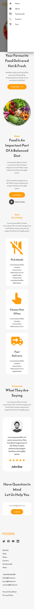

# Food Delivery Landing Page

A modern, responsive landing page for a food delivery service built with React and Material-UI.

## 🚀 Live Demo

**Vercel Deployment:** 

<!-- Paste your Vercel deployment link here -->

## 📸 Screenshots

### Desktop View


### Mobile View




### Features Showcase


## ✨ Features

- 🎨 Modern and clean design
- 📱 Fully responsive layout
- 🍔 Food delivery themed interface
- 🧭 Smooth navigation with mobile hamburger menu
- 💬 Customer testimonials section
- 📞 Contact information
- ⚡ Fast loading and optimized performance

## 🛠️ Tech Stack

- **Frontend:** React 19.1.0
- **UI Library:** Material-UI (MUI) 7.2.0
- **Icons:** React Icons 5.5.0
- **Styling:** CSS3 with custom styles
- **Build Tool:** React Scripts 5.0.1
- **Deployment:** Vercel

## 📦 Installation

1. **Clone the repository**
   ```bash
   git clone https://github.com/yourusername/landing-page.git
   cd landing-page
   ```

2. **Install dependencies**
   ```bash
   npm install
   ```

3. **Start the development server**
   ```bash
   npm start
   ```

4. **Open your browser**
   Navigate to `http://localhost:3000`

## 🏗️ Build for Production

```bash
npm run build
```

This creates a `build` folder with optimized production files.

## 🚀 Deploy to Vercel

### Method 1: Vercel CLI
1. Install Vercel CLI: `npm i -g vercel`
2. Run: `vercel`
3. Follow the prompts

### Method 2: GitHub Integration
1. Push your code to GitHub
2. Go to [vercel.com](https://vercel.com)
3. Import your GitHub repository
4. Deploy automatically

### Method 3: Drag & Drop
1. Run `npm run build`
2. Go to [vercel.com](https://vercel.com)
3. Drag the `build` folder to deploy

## 📁 Project Structure

```
landing-page/
├── public/
│   ├── favicon.ico
│   ├── index.html
│   └── manifest.json
├── src/
│   ├── Assets/
│   │   ├── Logo.svg
│   │   ├── home-banner-image.png
│   │   ├── home-banner-background.png
│   │   ├── about-background.png
│   │   ├── pick-meals-image.png
│   │   ├── choose-image.png
│   │   ├── delivery-image.png
│   │   └── john-doe-image.png
│   ├── Components/
│   │   ├── Navbar.jsx
│   │   ├── Home.jsx
│   │   ├── About.jsx
│   │   ├── Work.jsx
│   │   ├── Testimonials.jsx
│   │   ├── Contact.jsx
│   │   └── Footer.jsx
│   ├── App.css
│   ├── App.js
│   ├── index.css
│   └── index.js
├── docs/
│   └── images/          # Screenshots for README
├── package.json
└── README.md
```

## 🎨 Components Overview

- **Navbar**: Responsive navigation with mobile drawer menu
- **Home**: Hero section with banner and call-to-action
- **About**: Information about the service
- **Work**: Step-by-step process explanation
- **Testimonials**: Customer reviews and feedback
- **Contact**: Contact information and form
- **Footer**: Site footer with links

## Getting Started with Create React App

This project was bootstrapped with [Create React App](https://github.com/facebook/create-react-app).

## Available Scripts

In the project directory, you can run:

### `npm start`

Runs the app in the development mode.\
Open [http://localhost:3000](http://localhost:3000) to view it in your browser.

The page will reload when you make changes.\
You may also see any lint errors in the console.

### `npm test`

Launches the test runner in the interactive watch mode.\
See the section about [running tests](https://facebook.github.io/create-react-app/docs/running-tests) for more information.

### `npm run build`

Builds the app for production to the `build` folder.\
It correctly bundles React in production mode and optimizes the build for the best performance.

The build is minified and the filenames include the hashes.\
Your app is ready to be deployed!

### `npm run eject`

**Note: this is a one-way operation. Once you `eject`, you can't go back!**

If you aren't satisfied with the build tool and configuration choices, you can `eject` at any time. This command will remove the single build dependency from your project.

## 📱 Responsive Breakpoints

- Mobile: < 768px
- Tablet: 768px - 1024px
- Desktop: > 1024px

## 🎯 Performance Optimizations

- Optimized images in Assets folder
- Lazy loading for components
- Minimized bundle size
- SEO-friendly structure

## 🤝 Contributing

1. Fork the repository
2. Create a feature branch: `git checkout -b feature/new-feature`
3. Commit changes: `git commit -m 'Add new feature'`
4. Push to branch: `git push origin feature/new-feature`
5. Submit a pull request

## 📝 License

This project is licensed under the MIT License - see the [LICENSE](LICENSE) file for details.

## 📞 Contact

- **Developer**: Your Name
- **Email**: your.email@example.com
- **Portfolio**: https://yourportfolio.com
- **LinkedIn**: https://linkedin.com/in/yourprofile

## 🙏 Acknowledgments

- Material-UI for the component library
- React Icons for the icon set
- Vercel for hosting platform
- Create React App for the boilerplate

## Learn More

You can learn more in the [Create React App documentation](https://facebook.github.io/create-react-app/docs/getting-started).

To learn React, check out the [React documentation](https://reactjs.org/).

---

**⭐ If you found this project helpful, please give it a star!**

### Analyzing the Bundle Size

This section has moved here: [https://facebook.github.io/create-react-app/docs/analyzing-the-bundle-size](https://facebook.github.io/create-react-app/docs/analyzing-the-bundle-size)

### Making a Progressive Web App

This section has moved here: [https://facebook.github.io/create-react-app/docs/making-a-progressive-web-app](https://facebook.github.io/create-react-app/docs/making-a-progressive-web-app)

### Advanced Configuration

This section has moved here: [https://facebook.github.io/create-react-app/docs/advanced-configuration](https://facebook.github.io/create-react-app/docs/advanced-configuration)

### Deployment

This section has moved here: [https://facebook.github.io/create-react-app/docs/deployment](https://facebook.github.io/create-react-app/docs/deployment)

### `npm run build` fails to minify

This section has moved here: [https://facebook.github.io/create-react-app/docs/troubleshooting#npm-run-build-fails-to-minify](https://facebook.github.io/create-react-app/docs/troubleshooting#npm-run-build-fails-to-minify)
# landing-page
